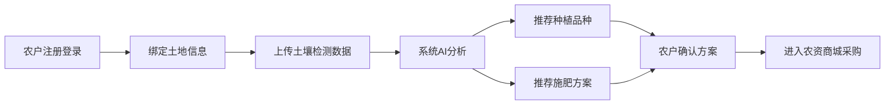
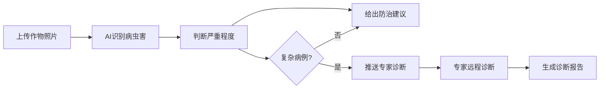

## 1. 产品概述

智慧农业综合服务平台是面向现代农业生产全链条的一站式服务APP，整合种植决策、农资采购、田间管理、农产品销售、溯源追踪、金融支持等核心功能，通过AI和大数据技术赋能农户，提升农业生产效率和收益。

- 核心目标：为农户提供智能化、数字化的农业生产全流程服务
- 目标用户：种植农户、农业企业、农资供应商、物流企业、平台管理员

## 2. 核心功能

### 2.1 用户角色

| 角色 | 注册方式 | 核心权限 |
|------|---------|---------|
| 农户用户 | 手机号注册，实名认证 | 土地管理、种植推荐、农资购买、田间管理、产品销售、金融贷款 |
| 农资供应商 | 企业资质审核入驻 | 商品管理、订单处理、库存管理 |
| 专家用户 | 资质认证 | 病虫害远程诊断、农技咨询 |
| 物流企业 | 企业资质审核入驻 | 订单配送、冷链追踪 |
| 平台管理员 | 后台账号登录 | 数据看板、用户管理、内容审核、报表导出 |

### 2.2 功能模块

1. **首页/农户端**：数据概览、快捷入口、气象信息、推荐资讯
2. **土地管理**：土地信息绑定、土壤检测数据、种植历史
3. **智能推荐**：品种推荐、施肥方案、产量预测
4. **农资商城**：商品浏览、购物车、在线支付、订单管理、物流追踪
5. **田间管理**：病虫害识别、防治建议、专家诊断、农事记录
6. **气象预警**：实时天气、灾害预警、防护建议
7. **农产品交易**：产品上架、智能定价、订单管理、冷链物流、溯源查询
8. **农业金融**：贷款申请、额度评估、还款管理
9. **会员中心**：等级权益、升级进度、礼遇推送
10. **管理员看板**：区域数据统计、实时监控、报表导出

### 2.3 页面详情

| 页面名称 | 模块名称 | 功能描述 |
|---------|---------|---------|
| 登录注册页 | 用户认证 | 手机号登录/注册、实名认证、角色选择 |
| 首页 | 数据概览 | 今日气象、种植提醒、快速入口、资讯轮播 |
| 土地管理页 | 土地信息 | 土地列表、添加土地、土壤数据、种植历史 |
| 智能推荐页 | AI推荐 | 品种推荐列表、施肥方案详情、产量预测 |
| 农资商城首页 | 商品展示 | 分类导航、搜索、商品列表、促销活动 |
| 商品详情页 | 商品信息 | 商品图片、规格选择、加入购物车、立即购买 |
| 购物车页 | 购物车管理 | 商品列表、数量调整、结算 |
| 订单列表页 | 订单管理 | 全部订单、待付款、待发货、待收货、已完成 |
| 物流追踪页 | 物流信息 | 物流节点、实时位置、预计送达 |
| 田间管理首页 | 功能入口 | 病虫害识别、农事记录、专家咨询 |
| 病虫害识别页 | AI识别 | 照片上传、识别结果、防治建议 |
| 专家诊断页 | 远程诊断 | 病例提交、专家列表、在线咨询、诊断报告 |
| 气象预警页 | 天气信息 | 实时天气、7日预报、灾害预警、防护建议 |
| 农产品交易首页 | 交易大厅 | 产品分类、热销推荐、预售专区 |
| 产品上架页 | 发布商品 | 产品信息、图片上传、定价建议、库存设置 |
| 溯源查询页 | 溯源信息 | 扫码查询、全链条信息展示 |
| 农业金融首页 | 金融服务 | 贷款产品、额度评估、申请记录 |
| 会员中心页 | 会员体系 | 等级展示、权益列表、升级进度、我的礼遇 |
| 管理员看板首页 | 数据大屏 | 区域概览、关键指标、图表可视化 |
| 报表导出页 | 运营报表 | 月度报表、多维度筛选、导出下载 |

## 3. 核心流程

### 3.1 农户种植决策流程

农户注册登录 → 绑定土地信息 → 上传土壤检测数据 → 系统分析土壤成分和历史产量 → 推荐最优种植品种和施肥方案 → 农户确认方案 → 进入农资商城采购

### 3.2 农资购买流程

浏览商品 → 加入购物车 → 结算下单 → 在线支付 → 系统匹配最近仓库 → 仓库发货 → 物流追踪 → 确认收货

### 3.3 病虫害诊断流程

上传作物照片 → AI自动识别病虫害类型和严重程度 → 给出防治建议 → 复杂病例推送专家 → 专家远程诊断 → 生成诊断报告

### 3.4 农产品销售流程

农户上架产品 → 系统智能推荐定价 → 买家浏览下单 → 生成电子订单 → 自动匹配冷链车辆 → 实时追踪温湿度和位置 → 买家收货 → 溯源码查询

## 4. 用户界面设计

### 4.1 设计风格

- **主色调**：绿色系 (#22c55e 草绿) 代表农业、生机、环保
- **辅助色**：金色 (#f59e0b) 代表丰收、温暖；蓝色 (#3b82f6) 代表科技、信任
- **中性色**：深灰 (#1f2937)、中灰 (#6b7280)、浅灰 (#f3f4f6)、白色 (#ffffff)
- **按钮风格**：圆角矩形 (8px)，主按钮绿色渐变，悬停有轻微上浮效果
- **字体**：使用 Noto Sans SC，标题加粗，正文清晰易读
- **布局风格**：卡片式布局，顶部导航 + 底部标签栏（移动端）
- **图标风格**：使用 Lucide 线性图标，统一 24px 尺寸
- **整体风格**：清新自然、科技感与田园气息结合，简洁易用

### 4.2 页面设计概述

| 页面名称 | 模块名称 | UI元素 |
|---------|---------|-------|
| 登录注册页 | 表单区域 | 渐变背景、品牌Logo、圆角输入框、主色按钮、社媒登录 |
| 首页 | 数据概览 | 顶部天气卡片、快捷入口网格、轮播资讯、推荐卡片列表 |
| 土地管理页 | 土地列表 | 土地卡片（面积、位置、土壤等级标签）、添加按钮、详情展开 |
| 智能推荐页 | AI推荐 | 推荐卡片（匹配度百分比、收益预测）、方案对比、确认按钮 |
| 农资商城首页 | 商品展示 | 分类图标导航、搜索栏、促销Banner、商品网格 |
| 田间管理首页 | 功能入口 | 大图标卡片网格、识别快捷按钮、农事记录时间线 |
| 管理员看板 | 数据大屏 | 深色背景、高亮数据指标、多图表布局、区域筛选器 |

### 4.3 响应式设计

- **设计原则**：Desktop-first，移动端自适应
- **断点设置**：sm (640px)、md (768px)、lg (1024px)、xl (1280px)
- **移动端优化**：底部标签栏导航、触控区域 ≥ 48px、单列布局、手势滑动支持
- **桌面端优化**：侧边栏导航、多列布局、悬停交互、右键菜单

### 4.4 动效设计

- **页面切换**：淡入淡出 + 轻微滑动
- **卡片悬停**：上浮 4px + 阴影加深
- **按钮点击**：缩放 0.98 + 颜色加深
- **数据加载**：骨架屏脉冲动画
- **图表展示**：数据渐进式加载动画
- **通知提示**：顶部滑入 + 渐变消失
