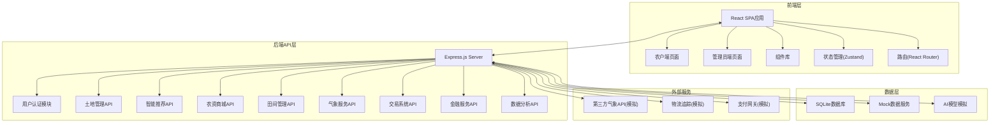
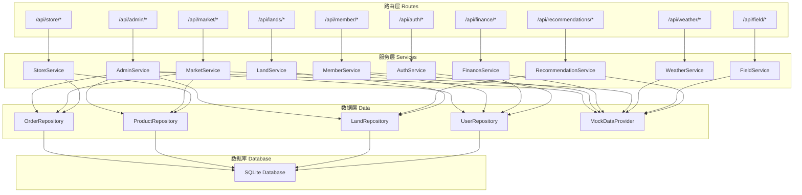
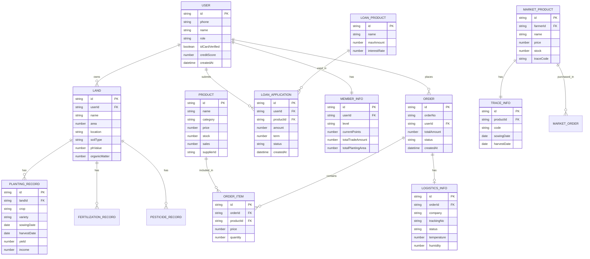

## 1. 架构设计



## 2. 技术栈描述

- **前端框架**: React@18 + TypeScript
- **构建工具**: Vite@5
- **样式方案**: TailwindCSS@3
- **状态管理**: Zustand@4
- **路由管理**: react-router-dom@6
- **UI组件**: Lucide React图标
- **图表库**: Recharts
- **后端框架**: Express@4 + TypeScript
- **数据库**: SQLite (本地模拟)
- **初始化工具**: vite-init (react-express-ts模板)
- **包管理器**: npm

## 3. 路由定义

### 3.1 前端路由

| 路由路径 | 页面组件 | 说明 |
|---------|---------|------|
| `/login` | Login | 登录注册页 |
| `/` | FarmerHome | 农户首页 |
| `/land` | LandManagement | 土地管理页 |
| `/recommendation` | Recommendation | 智能推荐页 |
| `/store` | StoreHome | 农资商城首页 |
| `/store/product/:id` | ProductDetail | 商品详情页 |
| `/store/cart` | ShoppingCart | 购物车页 |
| `/store/orders` | OrderList | 订单列表页 |
| `/store/orders/:id/logistics` | LogisticsTrack | 物流追踪页 |
| `/field` | FieldManagement | 田间管理首页 |
| `/field/pest-detection` | PestDetection | 病虫害识别页 |
| `/field/expert` | ExpertDiagnosis | 专家诊断页 |
| `/weather` | WeatherWarning | 气象预警页 |
| `/market` | MarketHome | 农产品交易首页 |
| `/market/publish` | PublishProduct | 产品上架页 |
| `/market/trace/:code` | TraceQuery | 溯源查询页 |
| `/finance` | FinanceHome | 农业金融首页 |
| `/member` | MemberCenter | 会员中心页 |
| `/admin` | AdminDashboard | 管理员看板首页 |
| `/admin/reports` | ReportsExport | 报表导出页 |

### 3.2 API路由定义

| 方法 | 路径 | 模块 | 说明 |
|-----|------|------|------|
| POST | `/api/auth/login` | 用户认证 | 用户登录 |
| POST | `/api/auth/register` | 用户认证 | 用户注册 |
| GET | `/api/auth/profile` | 用户认证 | 获取用户信息 |
| GET | `/api/lands` | 土地管理 | 获取土地列表 |
| POST | `/api/lands` | 土地管理 | 添加土地 |
| GET | `/api/lands/:id` | 土地管理 | 土地详情 |
| PUT | `/api/lands/:id` | 土地管理 | 更新土地信息 |
| GET | `/api/recommendations/crops` | 智能推荐 | 获取作物推荐 |
| GET | `/api/recommendations/fertilizer` | 智能推荐 | 获取施肥方案 |
| GET | `/api/store/products` | 农资商城 | 商品列表 |
| GET | `/api/store/products/:id` | 农资商城 | 商品详情 |
| POST | `/api/store/orders` | 农资商城 | 创建订单 |
| GET | `/api/store/orders` | 农资商城 | 订单列表 |
| GET | `/api/store/logistics/:id` | 农资商城 | 物流信息 |
| POST | `/api/field/detect-pest` | 田间管理 | 病虫害识别 |
| GET | `/api/field/experts` | 田间管理 | 专家列表 |
| POST | `/api/field/diagnosis` | 田间管理 | 提交诊断请求 |
| GET | `/api/weather/current` | 气象服务 | 当前天气 |
| GET | `/api/weather/forecast` | 气象服务 | 7日预报 |
| GET | `/api/weather/warnings` | 气象服务 | 灾害预警 |
| GET | `/api/market/products` | 交易系统 | 农产品列表 |
| POST | `/api/market/products` | 交易系统 | 上架产品 |
| GET | `/api/market/trace/:code` | 交易系统 | 溯源查询 |
| GET | `/api/finance/loan-products` | 金融服务 | 贷款产品 |
| POST | `/api/finance/loan-apply` | 金融服务 | 申请贷款 |
| GET | `/api/finance/credit-score` | 金融服务 | 信用评分 |
| GET | `/api/member/level` | 会员体系 | 会员等级信息 |
| GET | `/api/member/benefits` | 会员体系 | 会员权益 |
| GET | `/api/admin/dashboard` | 数据分析 | 看板数据 |
| GET | `/api/admin/reports` | 数据分析 | 运营报表 |

## 4. API类型定义

```typescript
// 用户类型
interface User {
  id: string;
  phone: string;
  name: string;
  role: 'farmer' | 'supplier' | 'expert' | 'logistics' | 'admin';
  avatar?: string;
  idCardVerified: boolean;
  memberLevel: 'normal' | 'silver' | 'gold' | 'diamond';
  creditScore: number;
  createdAt: string;
}

// 土地信息
interface Land {
  id: string;
  userId: string;
  name: string;
  area: number; // 亩
  location: string;
  province: string;
  city: string;
  soilType: string;
  phValue: number;
  organicMatter: number;
  nitrogen: number;
  phosphorus: number;
  potassium: number;
  plantingHistory: PlantingRecord[];
}

// 种植记录
interface PlantingRecord {
  id: string;
  landId: string;
  crop: string;
  variety: string;
  sowingDate: string;
  harvestDate?: string;
  yield: number; // kg
  income: number; // 元
}

// 作物推荐
interface CropRecommendation {
  id: string;
  crop: string;
  variety: string;
  matchScore: number; // 0-100
  expectedYield: number; // kg/亩
  expectedIncome: number; // 元/亩
  growthPeriod: number; // 天
  riskLevel: 'low' | 'medium' | 'high';
  reasons: string[];
}

// 施肥方案
interface FertilizerPlan {
  id: string;
  landId: string;
  crop: string;
  stages: FertilizerStage[];
  totalCost: number;
}

interface FertilizerStage {
  stage: string;
  period: string;
  fertilizers: FertilizerItem[];
  notes: string;
}

interface FertilizerItem {
  name: string;
  type: string;
  amount: number;
  unit: string;
}

// 商品
interface Product {
  id: string;
  name: string;
  category: 'seed' | 'fertilizer' | 'pesticide' | 'tool';
  images: string[];
  price: number;
  originalPrice?: number;
  specs: ProductSpec[];
  description: string;
  stock: number;
  sales: number;
  supplierId: string;
  supplierName: string;
}

interface ProductSpec {
  name: string;
  value: string;
  priceAdjust: number;
}

// 订单
interface Order {
  id: string;
  orderNo: string;
  userId: string;
  items: OrderItem[];
  totalAmount: number;
  status: 'pending' | 'paid' | 'shipped' | 'delivered' | 'completed' | 'cancelled';
  address: Address;
  warehouseId?: string;
  logisticsId?: string;
  createdAt: string;
  paidAt?: string;
  shippedAt?: string;
  deliveredAt?: string;
}

interface OrderItem {
  productId: string;
  productName: string;
  productImage: string;
  spec: string;
  price: number;
  quantity: number;
}

// 物流追踪
interface LogisticsInfo {
  orderId: string;
  company: string;
  trackingNo: string;
  status: string;
  currentLocation: string;
  estimatedArrival: string;
  temperature?: number;
  humidity?: number;
  tracks: LogisticsTrack[];
}

interface LogisticsTrack {
  time: string;
  location: string;
  status: string;
}

// 病虫害识别结果
interface PestDetectionResult {
  pestName: string;
  scientificName: string;
  severity: 'mild' | 'moderate' | 'severe';
  confidence: number;
  symptoms: string[];
  treatment: TreatmentPlan;
  needsExpert: boolean;
}

interface TreatmentPlan {
  immediateMeasures: string[];
  pesticides: PesticideRecommendation[];
  preventionTips: string[];
}

interface PesticideRecommendation {
  name: string;
  dosage: string;
  frequency: string;
}

// 气象信息
interface WeatherInfo {
  province: string;
  city: string;
  current: CurrentWeather;
  forecast: DailyForecast[];
  warnings: WeatherWarning[];
}

interface CurrentWeather {
  temperature: number;
  feelsLike: number;
  humidity: number;
  windSpeed: number;
  windDirection: string;
  condition: string;
  icon: string;
  updateTime: string;
}

interface DailyForecast {
  date: string;
  highTemp: number;
  lowTemp: number;
  condition: string;
  icon: string;
  precipitation: number;
  windSpeed: number;
}

interface WeatherWarning {
  id: string;
  type: string;
  level: 'blue' | 'yellow' | 'orange' | 'red';
  title: string;
  content: string;
  suggestions: string[];
  publishTime: string;
}

// 农产品
interface MarketProduct {
  id: string;
  farmerId: string;
  farmerName: string;
  name: string;
  category: string;
  images: string[];
  price: number;
  suggestedPrice: number;
  stock: number;
  unit: string;
  origin: string;
  harvestDate: string;
  description: string;
  traceCode: string;
  status: 'pending' | 'onsale' | 'soldout' | 'offline';
  createdAt: string;
}

// 溯源信息
interface TraceInfo {
  code: string;
  productId: string;
  productName: string;
  farmerName: string;
  origin: string;
  sowingDate: string;
  fertilizationRecords: FertilizationRecord[];
  pesticideRecords: PesticideRecord[];
  inspectionReport: InspectionReport;
  harvestDate: string;
  warehouseDate: string;
  deliveryDate?: string;
  receiveDate?: string;
}

interface FertilizationRecord {
  date: string;
  fertilizer: string;
  amount: string;
}

interface PesticideRecord {
  date: string;
  pesticide: string;
  purpose: string;
}

interface InspectionReport {
  date: string;
  agency: string;
  result: 'passed' | 'failed';
  items: { name: string; result: string; standard: string }[];
}

// 贷款信息
interface LoanProduct {
  id: string;
  name: string;
  maxAmount: number;
  minAmount: number;
  interestRate: number; // 年利率%
  termOptions: number[]; // 月数
  requirements: string[];
}

interface LoanApplication {
  id: string;
  userId: string;
  productId: string;
  amount: number;
  term: number;
  status: 'pending' | 'approved' | 'rejected' | 'repaid';
  approvedAmount?: number;
  interestRate?: number;
  repaymentDate?: string;
  createdAt: string;
}

interface CreditInfo {
  score: number;
  level: 'excellent' | 'good' | 'fair' | 'poor';
  factors: { factor: string; impact: 'positive' | 'negative'; description: string }[];
  maxLoanAmount: number;
}

// 会员信息
interface MemberInfo {
  userId: string;
  level: 'normal' | 'silver' | 'gold' | 'diamond';
  levelName: string;
  currentPoints: number;
  nextLevelPoints: number;
  upgradeProgress: number; // 0-100
  totalTradeAmount: number;
  totalPlantingArea: number;
  benefits: MemberBenefit[];
  gifts: MemberGift[];
}

interface MemberBenefit {
  id: string;
  name: string;
  description: string;
  icon: string;
  available: boolean;
}

interface MemberGift {
  id: string;
  name: string;
  description: string;
  expireDate: string;
  used: boolean;
}

// 管理员看板数据
interface DashboardData {
  overview: {
    totalFarmers: number;
    totalLands: number;
    totalArea: number;
    todayOrders: number;
    todaySales: number;
  };
  regionalCrops: { region: string; area: number; crop: string }[];
 农资Sales: { category: string; sales: number; growth: number }[];
  orderCompletion: { date: string; completionRate: number }[];
  pestIncidence: { region: string; rate: number }[];
  weatherWarnings: { level: string; count: number }[];
  logisticsOnTime: number;
}

// 运营报表
interface MonthlyReport {
  month: string;
  revenueByCategory: { category: string; revenue: number }[];
  farmerActiveRate: number;
  loanDefaultRate: number;
  logisticsCost: number;
  satisfactionScore: number;
  keyMetrics: {
    newUsers: number;
    totalOrders: number;
    totalSales: number;
    avgOrderValue: number;
  };
}
```

## 5. 服务端架构图



## 6. 数据模型

### 6.1 ER图



### 6.2 数据初始化

项目使用Mock数据进行演示，主要包含以下初始化数据：

- 10个示例农户用户
- 20块示例土地信息
- 50种农资商品（种子、化肥、农药、农具）
- 30个示例订单
- 20条气象预警记录
- 15种作物推荐方案
- 8个贷款产品
- 完整的会员等级配置

所有数据使用TypeScript定义，通过Mock服务层提供API响应。
